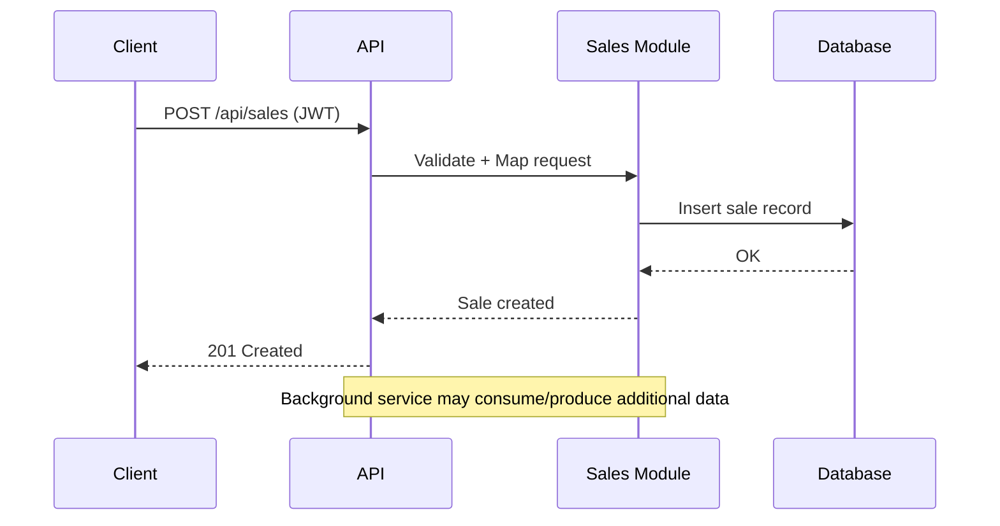

# SmartTrinity

SmartTrinity is a modular .NET solution providing an API and supporting services for the SmartTrinity application. The repository contains the main Web API project plus several module projects (Pumps, Sales, Prices, FuelStation, Migrations, etc.) used by the application.

This README documents how to build, run, debug and contribute to the solution from the workspace root.

## Contents

- `SmartTrinity.App.Api/` — ASP.NET Core Web API (entry point)
- `Modules/` — application modules and supporting projects (Pumps, Sales, Prices, FuelStation, Migrations, etc.)
- `.vscode/` — VS Code `launch.json` and `tasks.json` to build/run/debug the API

## Prerequisites

- .NET SDK 8.0 or later (project `TargetFramework` is `net8.0`)
- Optional: Visual Studio Code with C# extension (OmniSharp) for best developer experience

Verify your .NET SDK with:

```powershell
dotnet --version
```

## Build

From the workspace root you can build the API project:

```powershell
dotnet build ./SmartTrinity.App.Api/SmartTrinity.App.Api.csproj
```

Or use the VS Code default build task (Ctrl+Shift+B) which runs the `.vscode` `build` task.

## Run

To run the API from the command line:

```powershell
dotnet run --project ./SmartTrinity.App.Api/SmartTrinity.App.Api.csproj
```

VS Code task: Command Palette -> `Tasks: Run Task` -> select `run` (this runs the same `dotnet run --project ...` command in a background task).

## Debug

Open the workspace in VS Code and start the `.NET Core Launch (web-api)` configuration from the Run view. The `launch.json` included in `.vscode/` uses `preLaunchTask: "build"` and launches the API DLL from `SmartTrinity.App.Api/bin/Debug/net8.0/SmartTrinity.App.Api.dll`.

If you'd rather run `dotnet run` and attach, you can use the existing `.NET Core Attach` configuration or I can add a compound config that starts the `run` task and then attaches.

## Configuration

Key configuration files:

- `SmartTrinity.App.Api/appsettings.json`
- `SmartTrinity.App.Api/appsettings.Development.json`

Important settings to review before running:

- `AppSettings:Secret` — secret key used for JWT token signing. Set this in `appsettings.Development.json` for local development.
- `Clients` section — allowed CORS origins used by the API startup.
- `MigratorSettings`, `ConsoleSettings` — additional settings read by hosted services; check the `Program.cs` and related settings classes.

The API also sets up Serilog via configuration. Logs may be written to files depending on the Serilog configuration in `appsettings.json`.

## Project structure and modules

Top-level projects of interest:

- `SmartTrinity.App.Api` — main ASP.NET Core Web API (entry point). Uses Serilog, JWT authentication, API versioning, Swagger, and hosted services (`TrinityBackgroundService`).
- `Modules/SmartTrinity.App` — core application module referenced by the API.
- `Modules/SmartTrinity.App.Pumps` — pumps-related logic and DB code.
- `Modules/SmartTrinity.Sales` — sales-related module.
- `Modules/SmartTrinity.App.Prices` — prices module.
- `Modules/SmartTrinity.App.FuelStation` — fuel station module.
- `Modules/SmartTrinity.App.Migrations` — database migration helpers and migrators.

Each module is a separate project and is referenced by the API project via `ProjectReference` lines in `SmartTrinity.App.Api.csproj`.

## Running background services

The API registers a `TrinityBackgroundService` hosted service. If you run via `dotnet run` or via the debugger, the hosted service will start alongside the API.

## Architecture diagrams

Below are simple architecture diagrams to help visualize the system. The primary diagram uses Mermaid (rendered by many Markdown viewers). An ASCII fallback is provided for terminals or viewers that don't render Mermaid.

Mermaid - High-level architecture

```mermaid
graph LR
	Client[Client Applications]
	API[SmartTrinity.App.Api\n(ASP.NET Core Web API)]
	Subgraph Modules
		Pumps[SmartTrinity.App.Pumps]
		Sales[SmartTrinity.Sales]
		Prices[SmartTrinity.App.Prices]
		Fuel[SmartTrinity.App.FuelStation]
		Migrations[SmartTrinity.App.Migrations]
	end
	DB[(Database)]
	Messaging[SignalR / CommunicationManager]
	Background[TrinityBackgroundService]

	Client -->|HTTP / JWT| API
	API -->|ProjectReference / DI| Pumps
	API -->|ProjectReference / DI| Sales
	API -->|ProjectReference / DI| Prices
	API -->|ProjectReference / DI| Fuel
	API -->|Uses| Migrations
	API -->|SQL| DB
	Background -->|periodic tasks| API
	API --> Messaging
	Client -->|WebSocket| Messaging
```

Mermaid - Data flow (request example)



ASCII fallback - high-level

```
 [Client] --HTTP/JWT--> [SmartTrinity.App.Api]
															 |---> [SmartTrinity.App.Pumps]
															 |---> [SmartTrinity.Sales]
															 |---> [SmartTrinity.App.Prices]
															 |---> [SmartTrinity.App.FuelStation]
															 '---> [SmartTrinity.App.Migrations]
 [SmartTrinity.App.Api] --SQL--> [Database]
 [SmartTrinity.App.Api] --SignalR/WebSocket--> [Clients]
 [TrinityBackgroundService] (hosted) --> interacts with API and Modules
```

Diagram notes

- Authentication: API uses JWT (configured in `Program.cs`) to secure endpoints.
- Communication: SignalR and a `CommunicationManager` singleton provide real-time messaging between API and clients/devices.
- Modules: implemented as separate projects referenced by the API; each module contains its own DB access layer and services.
- Background processing: `TrinityBackgroundService` runs recurring or long-running tasks (migrators, device polling, etc.).

## Tests

There are no top-level test projects included in the repository root. If tests exist under modules, run them using `dotnet test` pointing at the test project.

## Contributing

- Fork or branch from the `SmartTrinity.App.sln` solution in this repository.
- Keep changes in feature branches and open pull requests against the default branch.
- Follow existing code patterns for DI registration, configuration and logging.

## Common tasks

- Build solution: `dotnet build SmartTrinity.App.sln`
- Run API: `dotnet run --project SmartTrinity.App.Api/SmartTrinity.App.Api.csproj`
- Publish API (release): `dotnet publish -c Release --output ./publish SmartTrinity.App.Api/SmartTrinity.App.Api.csproj`

## Notes

- The API uses `PathBase` `/api` in `Program.cs` which means endpoints are served under `/api` (e.g., `/api/health` — depending on controllers).
- Swagger is enabled and reachable when the app is running (the `serverReadyAction` in `launch.json` opens `/swagger`).
